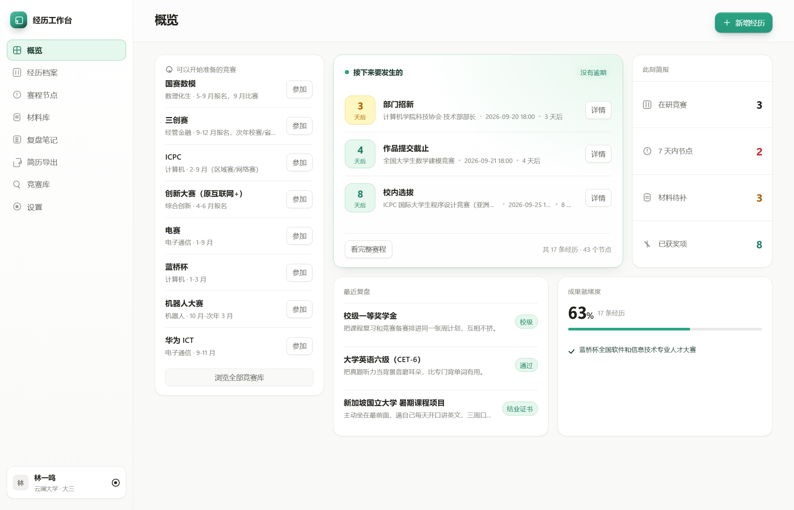
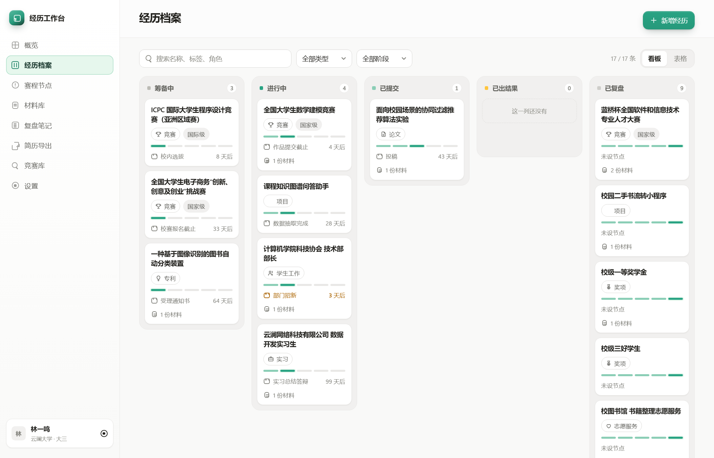
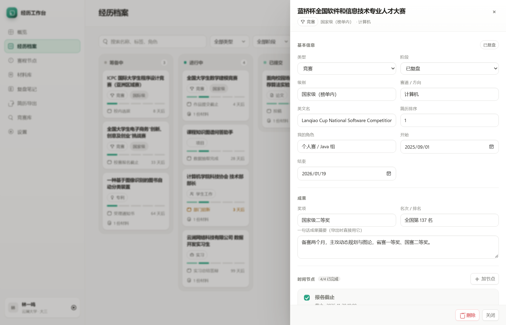
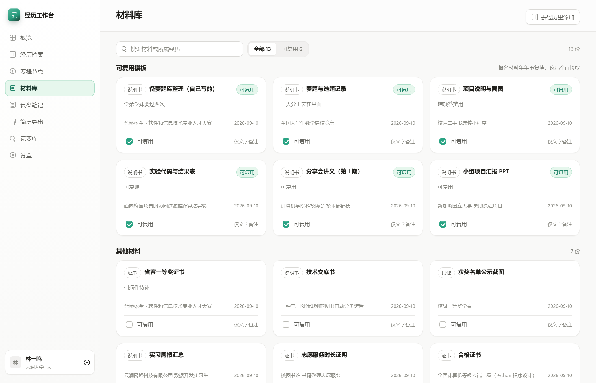
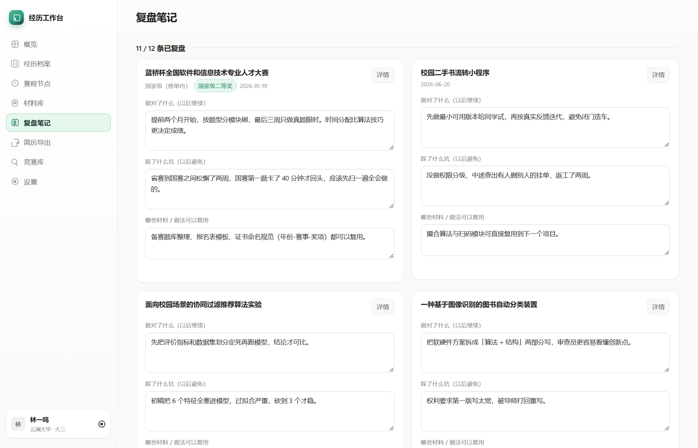
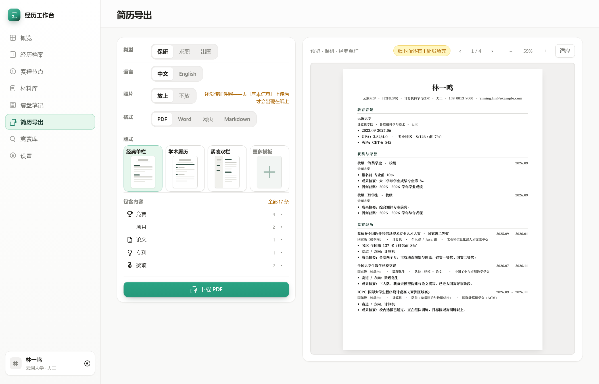
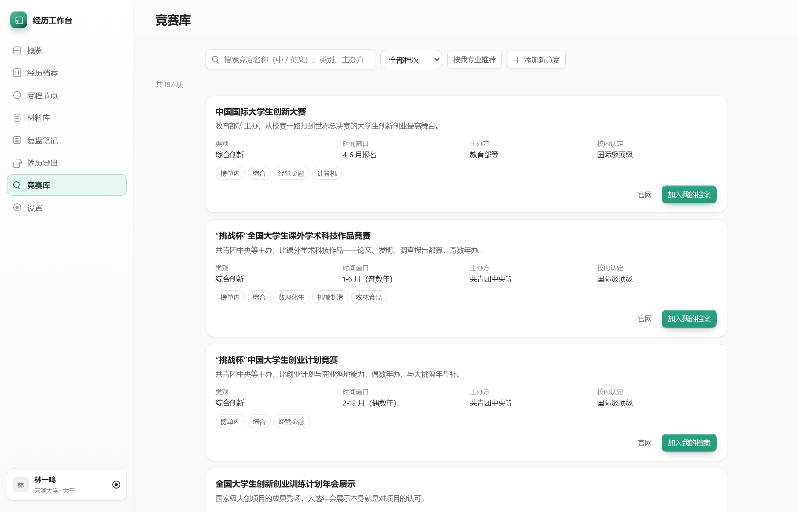
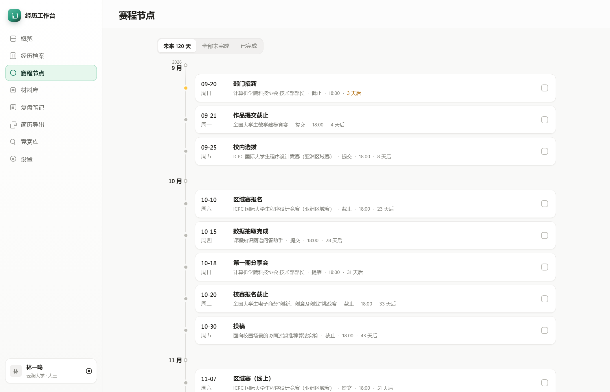
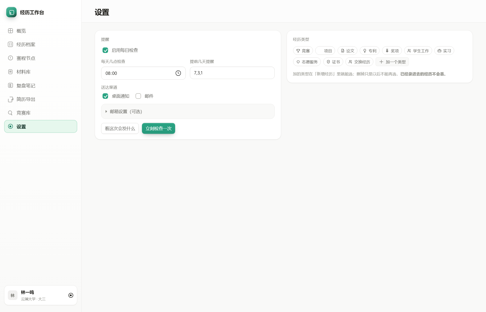

# 经历工作台 · Experience Workbench

[中文](README.md) | **English**

Put your **competitions, projects, papers, patents, awards, student work, internships, volunteer service, certificates, and exchange experiences** into one local workbench:
countdown reminders for deadlines, material archiving, retrospective notes, and one-click A4 resume export.

> A zero-dependency local service + zero-build frontend. All data lives on your own disk — no network, no uploads, no account required.



---

## Why this exists

Over four years of university you accumulate a dozen or so "notable" experiences — but when it comes time to write a resume, fill out postgraduate recommendation materials, or apply for an exchange program, you'll find that:

- Registration deadlines are scattered across WeChat, email, and QQ group messages — you're always relying on memory;
- Award certificates, work screenshots, and proof materials sit in several folders — every search costs half an hour;
- Each time you write a resume, you have to re-remember "what did I do, what place did I get";
- You want to reflect on "why didn't this competition make the finals" — but there's nowhere to record it.

This tool brings those four problems together in one place: **experience is the single thread**, and nodes (registration / submission / results), materials, and retrospectives all hang under each experience.

---

## Features

### Experience Archive
10 built-in types, each with its own dedicated fields — competitions record level / track / rank / role, papers record journal / author order / indexing status, patents record application number / grant date… The form fields change when you switch types, so you're never asked irrelevant questions. Types can be added or removed.



Three views: kanban (grouped by stage), table, and timeline. Click any entry to open a side-panel detail; edits save immediately.



### Schedule Nodes & Reminders
Each experience can hold several nodes: registration deadline → submission → results announcement, each with a configurable lead time (default 30/7/3/1 days). The service scans once a day at the time you set (default 08:00) and fires a native desktop notification; **on startup, missed reminders are re-sent once**, so you never lose one because the machine was off. Each reminder fires only once.

Desktop notifications use the native Windows Toast (Windows only); on macOS / Linux you can switch the channel to email, or handle the email content written to `data/outbox/` yourself.

### Material Library
Certificate photos, competition works, and PDF proofs are archived together in `data/attachments/`, previewable right in the page (images / PDF); Word documents get download links.



### Retrospective Notes
Write a note while it's fresh: what went right, where you got stuck, what to change next time. The overview page surfaces your recent retrospectives.



### Resume Export
Pick a track (grad school / job / study abroad) × language (Chinese / English) × layout × format (PDF / Word / Web / Markdown); see the live A4 paper preview on the right, with automatic pagination, page numbers, and "（续）/ (cont.)" markers across pages.
Single-column layouts paginate item by item — what you see is exactly what prints; **two-column / sidebar layouts are a whole-page flex container and break when split, so they skip on-screen pagination** and leave the real page count to the printer.

- 9 layouts: classic single column, minimal whitespace, academic CV, elegant serif, high density, compact two-column, sidebar color block, fresh two-column, top banner. Your three most-used can be pinned to the top; you can also upload your own HTML template;
- When content exceeds one page, the screen shows "N more items below the fold" — it only appears in the preview and is never printed;
- The study-abroad track locks to English; untranslated content is highlighted in yellow on the paper with a translation to-do list — deliberately printed, to force you to finish translating;
- ID photo supported, auto-placed per layout (single-column top-right, two-column sidebar top, banner right end).



### Competition Library
197 built-in competitions, covering mathematical modeling, Blue Bridge Cup, Internet+, ICPC, electronic design, and more: 164 with level ratings (137 national / 27 international), each with organizer, cadence, and suitable tracks; filterable by major, with one-click "add to my archive" that auto-fills the schedule. The remaining 33 carry basic info only — no guessed levels.

It also ships the MOE's 816-entry undergraduate majors catalog, with hierarchical matching in the search box.



### Overview
Active competitions, nodes due within 7 days, missing materials, awards won, plus recent retrospectives and achievement level.



### Settings
Reminder time and lead times, reminder channels (desktop / email), and adding or removing experience types — all here; saved on change.



---

## Quick Start

**Requirements: Node.js ≥ 18** (no `npm install` needed — the core is zero third-party dependencies)

Windows: double-click `start.bat`

macOS / Linux:

```bash
node server.js
```

Then open <http://127.0.0.1:8777> in your browser. If the port is taken it auto-increments (8778, 8779…); the console prints the actual address on startup.

On first launch, a `data/` directory with empty data is created automatically — ready to use out of the box.

---

## Directory Structure

```
server.js              local HTTP server (routes / static assets / write API)
public/
  index.html           single-page shell
  app.js               all frontend logic (views, forms, export layout)
  styles.css           CSS variable tokens + Bento grid
src/
  store.js             JSON read/write + rolling backup
  taxonomy.js          single source of truth for the 10 types (per-type fields)
  export.js            resume layout engine (3 tracks × 9 layouts × 4 formats)
  docx.js              zero-dependency .docx generation
  library.js           competition search & major matching
  reminder.js          daily reminders + catch-up on startup + desktop notifications
  demo.js              sample experiences
  seed/
    competitions.json  competition library data
    majors.json        MOE majors catalog
qa/                    self-check: CDP-driven real-browser functional & responsive assertions
tools/                 one-off data build scripts (idempotent, re-runnable)
docs/screenshots/      interface screenshots for the README
```

---

## Data & Privacy

- **Everything stays on this machine**: `data/*.json` + `data/attachments/`. No account system, no analytics, no telemetry of any kind.
- **Offline by default**: the only outbound channel is "email reminders", and it's **opt-in** — without SMTP nothing is ever sent; with it, it only connects to the mail server you specify. Desktop notifications use the OS channel. Email delivery depends on the optional `nodemailer` (only sends if installed; otherwise reminders are written to `data/outbox/`, so nothing is lost).
- **The repo contains no personal data**: `data/`, `data/attachments/`, `qa/out/`, and `*.log` are all in `.gitignore`.
- Every write lands on disk immediately, plus a rolling backup in `data/backups/` (latest version only) so accidental deletions can be rolled back.
- README screenshots use **fictional data** (Lin Yiming / Yunlan University), unrelated to any real person.

---

## Competition Data Sources

Competition entries are compiled from public channels: the China Association of Higher Education's "Analysis Report on National College Student Competitions", plus a university-internal competition recognition list. Organizers and cadence are organized from public information; **entries without recognition or with insufficient information intentionally leave descriptions blank — no guessing**.

The MOE majors catalog (`src/seed/majors.json`) comes from public MOE documents.

The library is a preparation reference only — for specific registration dates, formats, and award recognition, always defer to **the organizers' official notices and your school's recognition documents**.

---

## Self-Check

`qa/` holds two end-to-end suites driven by CDP against real Edge, with zero third-party dependencies:

```bash
node qa/check-func.js    # 155 checks: CRUD, export layout, reminders, materials, photo placement
node qa/check-resp.js    # 121 checks: responsive layout across 6 widths × 8 views
```

On the current code — **right after a fresh clone, on an empty library** — the results are **155 / 155, 121 / 121, with 0 console errors**.

The scripts provision their own fixtures (load sample experiences, add a fictional profile, generate a 1×1 ID photo on the fly, attach materials in three formats), and **only fill gaps — they never overwrite existing data**; if a precondition doesn't hold in the current dataset they record `SKIP` with a reason, which is not a failure.

Assertions cover geometric dimensions (relative relationships, not hardcoded pixels), real clicks, and exported paper pixels. Before running, it's recommended to copy the project into a sandbox directory first to avoid polluting real data — see `qa/README.md` for details and known issues.

---

## Development Conventions

- **Zero dependency, zero build**: no `node_modules`, no bundling step — refresh the page to apply changes. No frontend framework; state lives in a single `S` object.
- **Single source of truth**: experience types and their fields are defined only in `src/taxonomy.js`; the frontend reads them via `/api/state`, so server and client never maintain separate copies.
- README screenshots are captured by CDP driving a real browser against a **fictional dataset** — not hand-drawn mockups.

---

## License

[MIT](LICENSE)

The data sources of the built-in competition library (the CAHE competition analysis report list, a university academic competition project library, and the MOE undergraduate majors catalog) are copyrighted by their respective publishers; this project merely structures them for learning and research.
